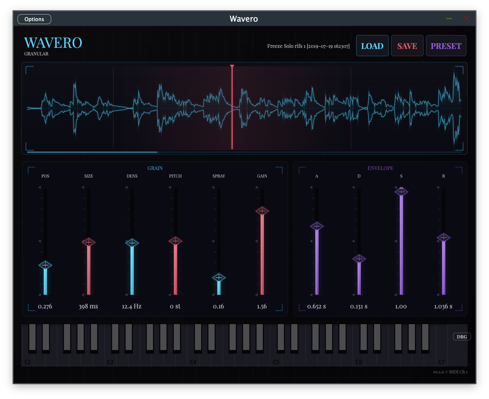

# Wavero

A granular synthesizer plugin with Art Deco aesthetics.



## Features

- **Granular Synthesis** - Load any audio sample and transform it into evolving textures
- **Intuitive Controls** - Position, grain size, density, pitch, spray, and gain
- **ADSR Envelope** - Shape your sound with attack, decay, sustain, and release
- **Normalized Waveform Display** - Quiet samples are automatically scaled for visibility
- **Scrollable Long Samples** - Drag or scroll to navigate samples over 60 seconds
- **Virtual MIDI Keyboard** - Play directly in standalone mode

## Formats

- VST3
- AU (macOS)
- CLAP
- Standalone

## Building

Requires CMake 3.25+ and a C++23 compiler.

```bash
cmake -B Builds -DCMAKE_BUILD_TYPE=Release
cmake --build Builds --config Release
```

## Credits

Built with [JUCE](https://juce.com) and the [Pamplejuce](https://github.com/sudara/pamplejuce) template.

Typography: [Playfair Display](https://fonts.google.com/specimen/Playfair+Display)

## License

GPL-3.0
